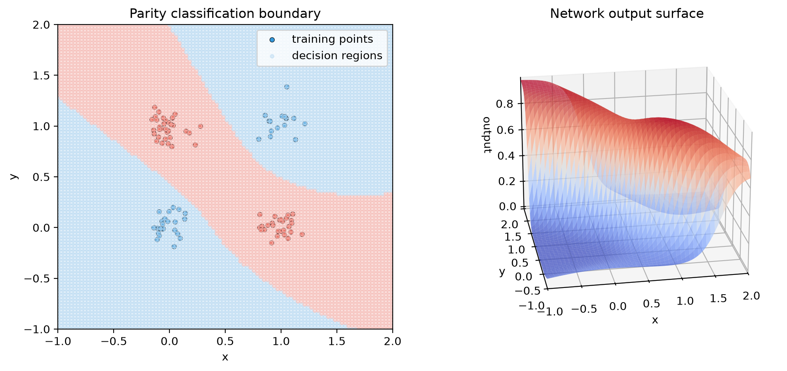

# Multi-Layer Perceptron

A compact NumPy-based implementation of a multilayer perceptron designed for learning, experimentation, and demos. The project focuses on the fundamentals of neural-network training: forward propagation, backpropagation, activation functions, and gradient-based optimization.

## Overview

This repository is intentionally small and educational. It is not a production ML framework, but it does provide a working end-to-end implementation of a feedforward network with a clean high-level API.

The package centers on the `Network` class and exposes a simple training workflow for supervised learning tasks:

- `Network(input_count, layer_sizes, activation_functions, activation_derivatives)`
- `Network.forward(inputs)`
- `Network.backprop(eta, output_derivatives)`
- `Network.fit(inputs, targets, epochs=100, learning_rate=0.01, error_derivative=...)`
- `Network.predict(inputs)`
- `Network.evaluate(inputs, targets)`

## Why this project exists

This project was built to explore how neural networks work at a low level:

- weights and biases are updated manually
- activations are defined explicitly
- gradients are propagated through each layer
- the training loop is designed to be readable rather than abstracted away

That makes it useful for understanding the mechanics behind modern ML libraries without depending on PyTorch or TensorFlow.

## Repository structure

- `src/multi_layer_perceptron/` — package source code
  - `network.py` — training loop, forward pass, and prediction utilities
  - `layer.py` — hidden-layer calculation and local gradient logic
  - `node.py` — single-neuron activation and weight math
  - `output_layer.py` — final-layer gradient handling
  - `output_node.py` — scalar output-node utility used in didactic examples
  - `activations.py` — sigmoid and tanh helper functions and derivatives
- `examples/` — runnable example scripts
  - `regression.py` — fits a function and saves plotting output
  - `parity.py` — trains a noisy parity-style classifier
  - `digits.py` — classifies images from scikit-learn's 8x8 handwritten-digits dataset
  - `plot_helpers.py` — plotting utilities for the examples
- `tests/` — regression tests covering validation, training, and API behavior
- `outputs/graphs/` — generated plots from example runs

## Installation

Python 3.9+ is required. Install the project in editable mode from the repository root:

```bash
python -m pip install --upgrade pip
python -m pip install -e .
```

To run the handwritten-digit example, install its optional dependency and run:

```bash
python -m pip install -e ".[examples]"
python examples/digits.py
```

Dependencies:

- `numpy`
- `matplotlib`

The digits example additionally requires the optional `scikit-learn` dependency installed with `.[examples]` above.

## Quick start

```python
import numpy as np
from multi_layer_perceptron import Network
from multi_layer_perceptron.activations import sigmoid, sigmoid_derivative

x = np.array([[0.0], [1.0], [2.0]], dtype=float)
y = np.array([[0.0], [1.0], [2.0]], dtype=float)

network = Network(
    input_count=1,
    layer_sizes=[1],
    activation_functions=[lambda z: z],
    activation_derivatives=[lambda _: 1.0],
)

history = network.fit(x, y, epochs=20, learning_rate=0.01)
predictions = network.predict(x)
mse = network.evaluate(x, y)

print(history)
print(predictions)
print(mse)
```

A simple hidden-layer example:

```python
from multi_layer_perceptron import Network
from multi_layer_perceptron.activations import sigmoid, sigmoid_derivative

network = Network(
    input_count=2,
    layer_sizes=[4, 1],
    activation_functions=[sigmoid, sigmoid],
    activation_derivatives=[sigmoid_derivative, lambda _: 1.0],
)

features = [[0.2, -0.7], [1.0, 0.5]]
print(network.forward(features[0]))
```

## Training workflow

The project supports a straightforward supervised-learning pattern:

```python
inputs = np.asarray(inputs, dtype=float)
targets = np.asarray(targets, dtype=float)

history = network.fit(inputs, targets, epochs=200, learning_rate=0.05)
predictions = network.predict(inputs)
loss = network.evaluate(inputs, targets)
```

A few implementation details are worth noting:

- `fit()` accepts both 1D and 2D inputs and reshapes automatically when needed.
- Each input sample must match the configured `input_count`.
- Each target sample must match the output-layer width.
- By default, the loss derivative is defined as `prediction - target`.

Networks initialize weights with Xavier initialization by default, which scales
random weights according to the sizes of the connected layers and sets biases to
zero. Select another scheme with the `weight_initialization` argument:

- `"xavier"` — uniform, zero-centered weights; the default and a suitable choice for sigmoid or tanh activations.
- `"he"` — normally distributed weights; commonly used with ReLU-style activations.
- `"uniform"` — legacy weights sampled uniformly from 0 to 1, including biases.

The network does not infer an initializer from activation functions, so choose
the scheme that suits the activations in your model.

## Example scripts

From the repository root, run:

```bash
python examples/regression.py
python examples/parity.py
python examples/digits.py
```

The digits example requires the optional dependency installed as shown above.
It uses scikit-learn's built-in handwritten-digits dataset: 1,797 flattened 8x8
images, with pixel values from 0 to 16 and labels from 0 to 9. This is a small
digits dataset, not the full MNIST dataset. Pixel values are scaled to [0, 1],
then a stratified 80/20 train/test split is used. The script prints accuracy on
the held-out test split; `--seed` defaults to 42 for a reproducible split and
training run. `--epochs` and `--learning-rate` can be used to adjust training.
With the default settings and seed 42, the example achieved **98.06% accuracy**
on the 360-image test split. This is a single holdout result, not a
cross-validation score.

The example scripts generate plots in `outputs/graphs/`:

- `regression.py` trains a network to approximate a target function.
- `parity.py` trains a noisy parity-style classifier and visualizes the decision boundary.
- `digits.py` trains a network to classify the 8x8 handwritten-digits dataset and reports held-out accuracy.

## Featured outputs

The project includes a few short demos:

### Regression fit

This example trains a small network to fit a quartic function and saves the learned curve alongside the training loss.

- `outputs/graphs/quartic_network.png`
- `outputs/graphs/quartic_network_loss.png`

### Parity classification

This example trains a binary classifier on synthetic noisy parity-like points and visualizes the learned separation boundary.

- `outputs/graphs/parity_1.png`
- `outputs/graphs/parity_1_loss.png`
- `outputs/graphs/parity_2.png`
- `outputs/graphs/parity_2_loss.png`

This plot comes from `parity_1`: the left panel shows the noisy training points for each class, while the right panel shows the model’s learned output surface across the input space, revealing the decision boundary it inferred.



### Simple linear fit

A single-node regression example illustrates the most basic form of gradient descent and function approximation.

- `outputs/graphs/linear_fit.png`

## Testing

The project includes a small test suite built with `unittest` and `pytest`-compatible conventions.

Run it with:

```bash
python -m pytest -q
```

or:

```bash
python -m unittest discover -s tests
```

## Current scope and limitations

This implementation is intentionally minimal and is best understood as a teaching project. It is useful for learning:

- gradient descent
- backpropagation
- activation functions
- layer-to-layer weight updates

It is not a general-purpose ML framework and does not include advanced tooling such as:

- distributed training
- batch optimization libraries
- GPU acceleration
- production model serialization
- a full training pipeline for large datasets

## License

This project is released under the MIT License.
